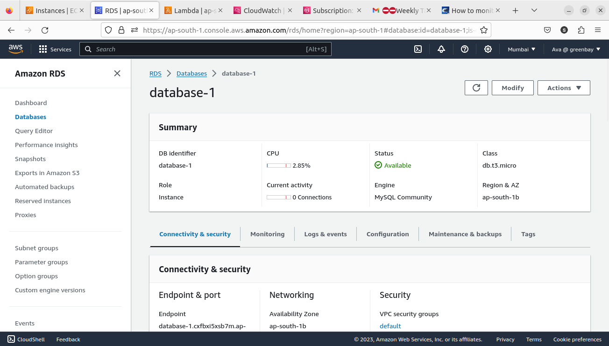
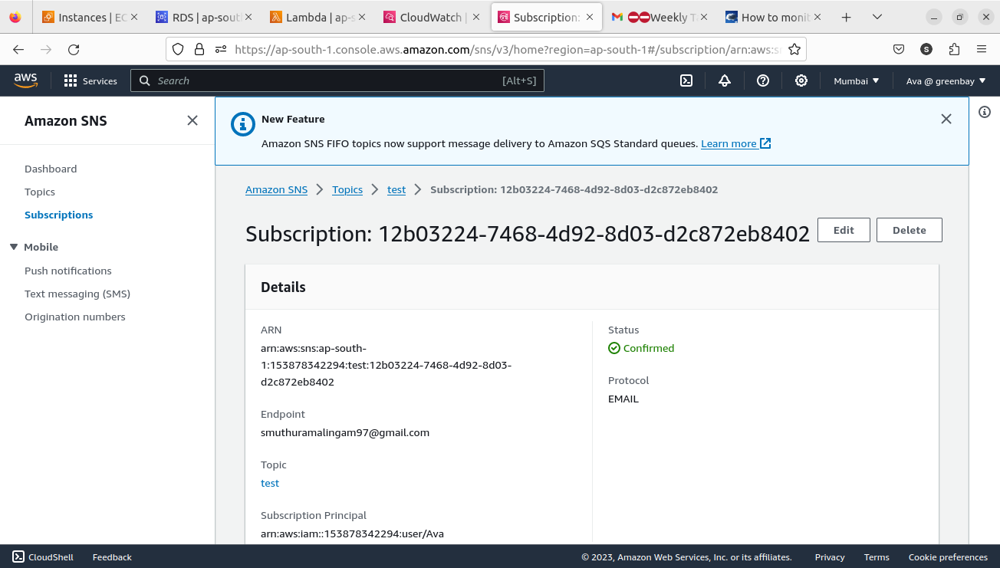

### Implement AWS Monitoring and Alerts

1. We have the following AWS resources, a server in EC2, My_SQL in RDS, Lambda function. 
2. In order to proactively detect issues with your AWS resources, we have configured AWS CloudWatch alarms to monitor critical metrics.  

 

 ### Sample Output 1: Configuration of AWS CloudWatch Alarms
 
 

 

   Ec2 instance CPU & memory usage

   we can set up many alarm as per our needs.

   These CloudWatch alarms are a fundamental part of our monitoring strategy, providing real-time visibility into the performance of your AWS resources. By setting up appropriate thresholds and actions, we can take immediate actions.

### Sample Output 2: Integration of AWS SNS for Alerting
  
  For email alerts, we have configured SNS to send notifications to the relevant email addresses. These alerts will include details about the alarm that was triggered and the resource affected, allowing for swift response and issue resolution.

 

 

 

 **received notification when our CPU usage goes above the threshold value**

 ### Sample Output 3: Creation of Custom CloudWatch Dashboards

    I have created custom CloudWatch dashboards to visualize resource performance and status. These dashboards provide a centralized and easy-to-access view of your AWS resources, aiding in troubleshooting and analysis.

 

  The custom dashboards display key metrics and graphs for my EC2 instances, RDS databases, and Lambda functions. 

  In simple terms, setting up CloudWatch alarms, integrating SNS, and using custom dashboards is like having a smart system to keep an eye on your important AWS resources. It helps you quickly know if something's wrong and make sure everything works smoothly.